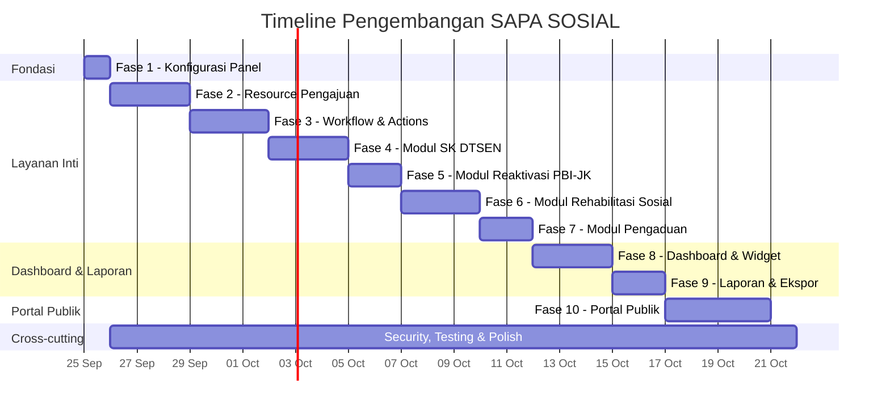

# 🚀 Rencana Aksi — SAPA SOSIAL Dashboard (Filament v5)

> **Proyek:** SAPA SOSIAL — Satu Pintu Layanan Sosial Kabupaten Blitar
> **Stack:** Laravel 13 · Filament v5.8 · Livewire v4 · PostgreSQL
> **Tanggal:** 25 September 2026

---

## 📊 Status Proyek Saat Ini

| Komponen | Status | Keterangan |
|----------|--------|------------|
| Database migrations (35 file) | ✅ Selesai | Semua tabel sesuai PRD sudah ada |
| Models (30 file) | ✅ Selesai | Relasi, enum, dan logika dasar |
| Enums (12 file) | ✅ Selesai | Status, handler, keputusan, dll |
| Seeders (12 file) | ✅ Selesai | Master data + sample data |
| Composer dependencies | ✅ Selesai | Filament v5.8, Spatie, DomPDF, QR |
| Filament Resources (9 master) | ✅ Selesai | User, District, Village, WorkUnit, ServiceType, DtsenPurpose, ClientCategory, ComplaintCategory, ReferralInstitution |
| **Filament Resources (layanan)** | ❌ Belum | ServiceRequest, DtsenCertificate, PbiReactivation, RehabilitationCase, Complaint |
| **Dashboard widgets** | ❌ Belum | Semua widget di PRD Bagian 3 |
| **Actions & workflow** | ❌ Belum | Transisi status, disposisi, approval |
| **Laporan & ekspor** | ❌ Belum | Excel & PDF |
| **Portal publik** | ❌ Belum | Livewire full-page components |
| **PDF generation** | ❌ Belum | SK DTSEN, Surat Rekomendasi PBI |
| **Policies & hak akses** | ❌ Belum | Spatie permission + Filament policy |

---

## 📋 Fase Pengembangan

### Fase 1 — Fondasi & Konfigurasi Panel ⏱️ ~1 hari
> **Prioritas:** 🔴 Kritis — semua fase lain bergantung pada ini

| # | Task | Detail | File/Lokasi |
|---|------|--------|-------------|
| 1.1 | Konfigurasi Panel Admin Filament | Setup panel `/admin` dengan branding SAPA SOSIAL, navigasi grup per modul, dark mode, bahasa Indonesia | `app/Providers/Filament/AdminPanelProvider.php` |
| 1.2 | Konfigurasi timezone & locale | Set `Asia/Jakarta`, locale `id`, fallback `en` | `config/app.php` |
| 1.3 | Setup navigasi grup | Kelompokkan menu: **Master Data**, **Layanan**, **Rehabilitasi Sosial**, **Pengaduan**, **Informasi**, **Pengguna & Akses** | `AdminPanelProvider` + setiap Resource `$navigationGroup` |
| 1.4 | Setup Spatie Permission + Role seeder | Definisikan 6 role (administrator, petugas_dinsos, pejabat_penandatangan, pimpinan, operator_kecamatan_desa, masyarakat) dan permission per resource | `UserSeeder.php` atau `RolePermissionSeeder.php` |
| 1.5 | Middleware autentikasi panel | Filament gate, redirect logic, role-based menu visibility | `AdminPanelProvider.php` |

---

### Fase 2 — Resource Pengajuan Layanan (ServiceRequest) ⏱️ ~3 hari
> **Prioritas:** 🔴 Kritis — tulang punggung Layanan 1, 2, dan 4

| # | Task | Detail |
|---|------|--------|
| 2.1 | **ServiceRequestResource** | Resource utama: list, create, edit, view |
| 2.2 | Table columns & filters | Kolom: nomor tiket, pemohon, jenis layanan, status (badge warna), petugas, tanggal. Filter: status, jenis layanan, kecamatan, desa, periode |
| 2.3 | Form schema — data pemohon | Nama, NIK, No. KK, alamat, desa/kelurahan (dependent select district→village), No. HP |
| 2.4 | Form schema — pilih jenis layanan | Dropdown service_type, handler-aware: tampilkan field tambahan sesuai handler (dtsen/pbi/generic) |
| 2.5 | Form schema — upload dokumen | Repeater dinamis sesuai `service_requirements` dari `service_type` yang dipilih; validasi mime type & mandatory |
| 2.6 | Infolist schema (halaman view) | Layout 2 kolom: data pemohon, data layanan, dokumen, riwayat status, catatan petugas |
| 2.7 | Auto-generate nomor tiket | Gunakan `NumberSequence::generate()` dengan format `{code}-YYYYMM-NNNNN`, lockForUpdate() |
| 2.8 | Scope data per role | Operator → hanya wilayahnya; Masyarakat → hanya miliknya; Petugas → semua |

---

### Fase 3 — Workflow & Actions (Transisi Status) ⏱️ ~3 hari
> **Prioritas:** 🔴 Kritis — logic inti alur layanan

| # | Task | Detail |
|---|------|--------|
| 3.1 | **Status transition actions** | Filament Actions per transisi: Periksa Dokumen, Minta Revisi, Verifikasi Data, Proses, Tolak, Selesai. Setiap action otomatis tulis ke `status_histories` |
| 3.2 | **Validasi transisi** | Enum method `allowedTransitions()`: pastikan status hanya bisa berubah sesuai alur PRD. Mis: `submitted` → hanya bisa ke `document_check` atau `rejected` |
| 3.3 | **Document check action** | Petugas review dokumen, bisa set verification_status per dokumen (valid/revision_needed), jika ada yang revision_needed → otomatis status `revision_requested` |
| 3.4 | **Disposisi action** | Assign ke unit kerja/petugas, catat di tabel `dispositions` |
| 3.5 | **Observer / Model Event** | Setiap perubahan status → otomatis create StatusHistory record + log activity |
| 3.6 | **SLA tracking** | Hitung hari sejak submitted, bandingkan dengan `service_types.sla_days`; tandai overdue |

---

### Fase 4 — Modul SK DTSEN (Layanan 1) ⏱️ ~3 hari
> **Prioritas:** 🔴 Kritis — layanan paling sering diakses

| # | Task | Detail |
|---|------|--------|
| 4.1 | **DtsenCertificateResource** | Sub-resource atau RelationManager di ServiceRequest (filter handler=dtsen) |
| 4.2 | Form field tambahan DTSEN | Tujuan penggunaan (select dtsen_purposes), nama & NIK orang yang diterangkan, hubungan dengan pemohon, keterangan tujuan |
| 4.3 | **Cek SIKS-NG action** | Form modal: terdaftar/tidak, desil, tanggal cek → simpan ke dtsen_certificates; validasi desil ≤ max_decile dari dtsen_purposes |
| 4.4 | **Buat draf surat action** | Generate nomor surat (format surat dinas), buat record draft |
| 4.5 | **Approval berjenjang** | Step 1: Paraf Kabid → Step 2: Tanda tangan Kadis. Gunakan tabel `approvals`. Action "Paraf"/"Setujui"/"Kembalikan" per step |
| 4.6 | **Generate PDF SK DTSEN** | Template Blade + DomPDF: header dinas, isi surat, tanda tangan, QR code verifikasi. Simpan file_path |
| 4.7 | **Kode verifikasi & QR** | Generate verification_code unik, embed QR menuju `/verifikasi/{code}` |
| 4.8 | **Masa berlaku** | Hitung `valid_until` dari `dtsen_purposes.validity_days`; tandai expired |
| 4.9 | **Deteksi duplikasi** | Cek pemohon + tujuan yang sama + surat masih berlaku → tampilkan warning ke petugas |

---

### Fase 5 — Modul Reaktivasi PBI-JK (Layanan 2) ⏱️ ~2 hari
> **Prioritas:** 🔴 Kritis

| # | Task | Detail |
|---|------|--------|
| 5.1 | **PbiReactivationResource** | Sub-resource/RelationManager di ServiceRequest (filter handler=pbi) |
| 5.2 | Form field tambahan PBI | Nama & NIK peserta, nomor BPJS/KIS, tanggal nonaktif, alasan reaktivasi (select enum), faskes, surat keterangan faskes |
| 5.3 | **Prioritas darurat medis** | Alasan `emergency` atau `catastrophic` → auto set `is_priority = true`, tampil paling atas di list |
| 5.4 | **Verifikasi kelayakan** | Cek desil & status SIKS-NG, catat eligibility_notes |
| 5.5 | **Surat rekomendasi** | Generate nomor rekomendasi + approval berjenjang + PDF |
| 5.6 | **Status lanjutan** | Action: Usulkan ke Kemensos (catat tanggal), Keputusan Kemensos (setuju/tolak), Aktif Kembali (catat tanggal) |
| 5.7 | **Alert tertahan** | Pengajuan di status `proposed_to_ministry` > N hari → badge "Perlu Ditindaklanjuti" |

---

### Fase 6 — Modul Rehabilitasi Sosial (Layanan 3) ⏱️ ~3 hari
> **Prioritas:** 🔴 Kritis

| # | Task | Detail |
|---|------|--------|
| 6.1 | **ClientResource** | CRUD klien: identitas, kategori, alamat, data sensitif (akses terbatas) |
| 6.2 | **RehabilitationCaseResource** | List kasus aktif, nomor kasus, klien, petugas, sumber (link ke service_request/complaint), status |
| 6.3 | **Assessment RelationManager** | Form assessment: tanggal, hasil, kebutuhan pelayanan, rekomendasi, perlu rujukan? |
| 6.4 | **Referral RelationManager** | Buat rujukan (hanya jika assessment.needs_referral=true), pilih lembaga tujuan, assign petugas PJ, tracking status rujukan |
| 6.5 | **MonitoringRecord RelationManager** | Catatan monitoring: tanggal, petugas, perkembangan, hasil. Wajib sebelum kasus closed |
| 6.6 | **Workflow kasus** | Status transitions: received→assessment→service_planning→in_service→monitoring→closed |
| 6.7 | **Akses data sensitif** | Policy: hanya petugas yang ditugaskan + admin yang bisa lihat detail klien |

---

### Fase 7 — Modul Pengaduan Sosial (Layanan 5) ⏱️ ~2 hari
> **Prioritas:** 🟡 Tinggi

| # | Task | Detail |
|---|------|--------|
| 7.1 | **ComplaintResource** | CRUD pengaduan: nomor laporan, kategori, pelapor, lokasi, deskripsi, lampiran, status |
| 7.2 | **ComplaintAttachment RelationManager** | Upload foto/dokumen, preview |
| 7.3 | **Workflow pengaduan** | Status transitions: received→verification→dispatched→in_handling→resolved. Klarifikasi ↺ |
| 7.4 | **Disposisi** | Assign ke unit/petugas, catat instruksi |
| 7.5 | **Deteksi duplikasi** | Tandai duplikat, link ke laporan induk |
| 7.6 | **Konversi ke kasus rehsos** | Action: "Buat Kasus Rehabilitasi" → otomatis buat RehabilitationCase dengan source complaint_id |

---

### Fase 8 — Dashboard & Widget ⏱️ ~3 hari
> **Prioritas:** 🟡 Tinggi — kebutuhan utama pimpinan

| # | Widget | Tipe | Detail |
|---|--------|------|--------|
| 8.1 | SK DTSEN Diterbitkan | **StatsOverviewWidget** | Jumlah terbit per periode, breakdown per tujuan & desil |
| 8.2 | SK DTSEN Menunggu TTD | **StatsOverviewWidget** | Antrean draf menunggu paraf/persetujuan |
| 8.3 | Reaktivasi PBI per Tahap | **StatsOverviewWidget** | Jumlah per status + tertahan > batas hari |
| 8.4 | Reaktivasi Darurat Medis | **TableWidget** | List pengajuan prioritas belum selesai |
| 8.5 | Kasus Rehsos Aktif | **StatsOverviewWidget** | Kasus per status + rujukan per lembaga |
| 8.6 | Pengajuan & Pengaduan Masuk | **ChartWidget** | Bar/line chart jumlah baru per periode, per jenis layanan |
| 8.7 | Dalam Proses vs Selesai | **ChartWidget** | Donut chart perbandingan tiket aktif vs selesai |
| 8.8 | Sebaran per Wilayah | **TableWidget** | Jumlah layanan & pengaduan per kecamatan/desa |
| 8.9 | **Filter global** | **Custom** | Filter periode, jenis layanan, status, kecamatan, desa. Operator hanya lihat wilayahnya |
| 8.10 | Info Paling Sering Diakses *(opsional)* | **TableWidget** | Konten populer + kata kunci teratas |

---

### Fase 9 — Laporan & Ekspor ⏱️ ~2 hari
> **Prioritas:** 🟡 Tinggi

| # | Task | Detail |
|---|------|--------|
| 9.1 | **Rekap SK DTSEN** | Filament Export Action / custom: filter periode, tujuan, desil, wilayah → Excel & PDF |
| 9.2 | **Rekap Reaktivasi PBI-JK** | Per alasan, status, keputusan Kemensos, lama proses rata-rata, wilayah |
| 9.3 | **Laporan Rehabilitasi Sosial** | Jumlah kasus & rujukan, kategori klien, lembaga, status, hasil |
| 9.4 | **Laporan Pelayanan (semua jenis)** | Per jenis layanan, status, periode, wilayah |
| 9.5 | **Laporan Pengaduan** | Per kategori, status, wilayah, periode |
| 9.6 | **PDF laporan** | Template Blade + DomPDF: kop dinas, tabel rekap, tanda tangan |
| 9.7 | **Queue processing** | Laporan besar di-generate via Laravel Queue agar tidak timeout |

---

### Fase 10 — Portal Publik (Livewire v4) ⏱️ ~4 hari
> **Prioritas:** 🟢 Menengah — bisa di-launch setelah panel admin berjalan

| # | Task | Detail |
|---|------|--------|
| 10.1 | **Layout & Landing Page** | Livewire full-page component, Tailwind CSS v4, responsive, hero section, daftar layanan |
| 10.2 | **Halaman Informasi Layanan** | Daftar layanan (search), detail (persyaratan, alur, jadwal, kontak), unduh formulir, FAQ |
| 10.3 | **Form Pengajuan Layanan** | Livewire component + Filament Schemas (`HasSchemas`+`InteractsWithSchemas`), pilih jenis → dynamic fields & upload |
| 10.4 | **Form Pengaduan** | Kategori, lokasi (kecamatan→desa), deskripsi, upload bukti |
| 10.5 | **Cek Status Tiket** | Input nomor tiket + 4 digit terakhir NIK/HP → tampilkan timeline status |
| 10.6 | **Verifikasi SK DTSEN** | Input kode verifikasi atau scan QR → tampilkan data surat & status keabsahan (berlaku/expired) |
| 10.7 | **Area Akun Masyarakat** *(opsional)* | Login, riwayat pengajuan, notifikasi status |

---

### Fase Tambahan — Security, Testing & Polish ⏱️ ~2 hari
> **Prioritas:** 🟢 Penting — berjalan paralel dengan fase lain

| # | Task | Detail |
|---|------|--------|
| T.1 | **Policy untuk setiap Resource** | Spatie permission integration, viewAny/view/create/update/delete per role |
| T.2 | **Global scope per wilayah** | Operator kecamatan/desa hanya query data wilayahnya |
| T.3 | **Audit logging** | Spatie ActivityLog di setiap model transaksi |
| T.4 | **File storage privat** | Disk `local`, akses via temporary signed URL, bukan public |
| T.5 | **Validasi input** | Request validation, sanitize NIK/KK (16 digit), phone, file size |
| T.6 | **Testing** | Feature tests (Pest) terhadap PostgreSQL: workflow transitions, permission, duplikasi, nomor tiket |
| T.7 | **Seed data realistis** | Expand SampleDataSeeder untuk demo dashboard |

---

## 🗓️ Ringkasan Timeline

---

## ⚡ Estimasi Total

| Kategori | Estimasi |
|----------|----------|
| **Panel Admin (Fase 1–9)** | ~22 hari kerja |
| **Portal Publik (Fase 10)** | ~4 hari kerja |
| **Security & Testing** | ~2 hari kerja (paralel) |
| **Total** | **~26 hari kerja** |

---

## 📌 Urutan Eksekusi yang Disarankan

> [!IMPORTANT]
> Mulai dari **Fase 1 → 2 → 3** secara berurutan karena semua resource dan workflow bergantung pada fondasi ini.

> [!TIP]
> Setelah Fase 3 selesai, **Fase 4–7 bisa dikerjakan secara paralel** jika ada lebih dari satu developer, karena masing-masing modul relatif independen.

### Milestone Utama

1. **🏁 Milestone 1** — Fase 1–3 selesai: Panel admin fungsional, pengajuan bisa dibuat & diproses
2. **🏁 Milestone 2** — Fase 4–5 selesai: SK DTSEN & Reaktivasi PBI-JK end-to-end (termasuk PDF & approval)
3. **🏁 Milestone 3** — Fase 6–7 selesai: Rehabilitasi sosial & pengaduan lengkap
4. **🏁 Milestone 4** — Fase 8–9 selesai: Dashboard real-time & laporan berkala → **Siap UAT internal**
5. **🏁 Milestone 5** — Fase 10 selesai: Portal publik → **Siap soft launch**

---

## ⚠️ Hal yang Perlu Dikonfirmasi Sebelum Mulai

| # | Pertanyaan | Dampak |
|---|-----------|--------|
| 1 | Format penomoran surat dinas yang berlaku? | Fase 4.4, 5.5 — template nomor SK & rekomendasi |
| 2 | Apakah notifikasi (WA/SMS/email) masuk scope? | Fase 3 — perlu tambah notification channel |
| 3 | Tanda tangan elektronik (TTE/BSrE) atau QR saja? | Fase 4.6 — library integrasi TTE |
| 4 | Nilai awal batas desil per tujuan DTSEN? | Fase 4.3 — seeder dtsen_purposes |
| 5 | Batas lama nonaktif PBI-JK? | Fase 5.2 — validasi kelayakan |
| 6 | Apakah masyarakat perlu login/register? | Fase 10.7 — area akun masyarakat |

---

> [!NOTE]
> Rencana ini disusun berdasarkan [PRD_SAPA_SOSIAL.md](file:///c:/laragon/www/app-layanan/PRD_SAPA_SOSIAL.md) dan kondisi proyek saat ini. Semua migration, model, enum, dan 9 resource master data sudah tersedia. Fokus pengembangan selanjutnya adalah **resource layanan, workflow, dashboard, dan portal publik**.
